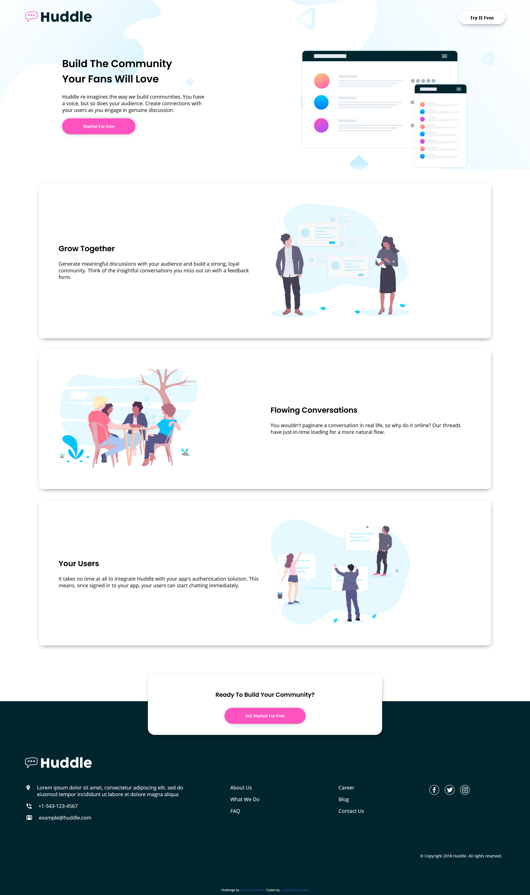

# Sobre este projeto:

Este projeto consiste em um desafio imposto para os integrantes da segunda turma do Paketá Academy, ele foi tirado do site:

www.frontendmentor.io/

O desafio consiste em reconstruir a landing page apresentada pelo site da frontendmentor, ela não precisava ser responsiva, o foco é construir ela o mais próximo da original possível, trabalhando assim a estrutura e as semânticas do HTML, e as propriedades de personalização do CSS.

Através desse projeto inicie meus estudos sobre Flexbox, pretendo me aperfeiçoar mais sobre o assunto colocando em prática mais projetos como este.

# Links:

* Link do desafio:
    
    https://www.frontendmentor.io/challenges/huddle-landing-page-with-alternating-feature-blocks-5ca5f5981e82137ec91a5100

* Link para visualizar minha solução do desafio:

    http://lucasbarbosadias.github.io/landing-page-huddle

* Liks de estudo para quem tiver interesse em aprender Flexbox:

    https://css-tricks.com/snippets/css/a-guide-to-flexbox/

    https://flexboxfroggy.com/
    
# Meu resultado final:

# Anotações para estudo do Flexbox:

display: flex;

para alinhar na horizontal:
	justify-content
		flex-start: Os itens são alinhados ao lado esquerdo do contêiner.
		flex-end: Os itens são alinhados ao lado direito do contêiner.
		center: Os itens são alinhados no centro do contêiner.
		space-between: Os itens são exibidos com espaçamento igual entre eles.
		space-around: Os itens são exibidos com espaçamento igual ao redor deles.

para alinhar na vertical:
	align-items:
		flex-start: Os itens são alinhados ao topo do contêiner.
		flex-end: Os itens são alinhados ao fundo do contêiner.
		center: Os itens são alinhados no centro vertical do contêiner.
		baseline: Os itens são exibidos na linha de base do contêiner.
		stretch: Os itens são esticados para caber no contêiner.

para definir a direção em que os itens são colocados no container:
	flex-direction
		row: Os itens são colocados da mesma forma que a direção do texto.
		row-reverse: Os itens são posicionados opostos à direção do texto.
		column: Os itens são colocados de cima para baixo.
		column-reverse: Os itens são colocados de baixo para cima.

OBS:
	Observe que quando você define a direção para uma linha ou coluna invertida, o início e o fim também são invertidos.
	Observe que quando a direção flexível é uma coluna, justify-contentmuda para vertical e align-items horizontal.
